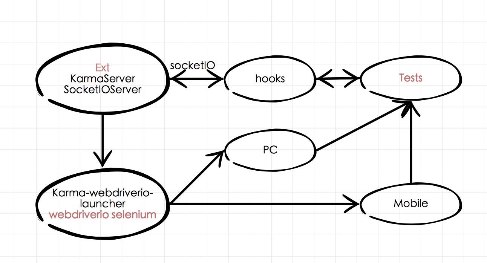

## karma-event-driver-ext

### Introduction
----------------

[](xx)

This project aims to integrate webdriverio into karma, for writing event-drive-tests conveniently.

for example, in your browser side test code, call webdriverio api to simulate dragAndMove behavior:

```jsx
    await runCommand((browser) => {
        browser.moveToObject(document.body, 0, 0); // top-left corner
        browser.buttonDown(); // left-mouse down
        browser.moveTo(null, 0, -100); // mouse-move -100 on the Y-axis
        browser.buttonUp(); // left-mouse up
    });
```


### usage

npm install

karma.conf.js

```jsx
module.exports = {
     customLaunchers: {
        'Chrome': {
            base: 'WebDriverio',
            browserName: 'chrome',
            name: 'Karma'
        }
    },
    browsers: ['Chrome'],
    ...
}
```

Tests code [webdriverio api](http://webdriver.io/api.html):

```jsx
    import eventHook, { beforeHook, afterHook, runCommand } from 'karma-event-driver-ext/cjs/event-drivers-hooks';
    describe('Event Drive Tests', function() {
        // Notice: timeout, before,    after is chai-sinon api, if jasmine, should be:
        //                , beforeAll, afterAll
        // worst of all is that jasmine has no support for returning a promise, u must call 'done' manually.
        // increase timeout
        this.timeout(200000);
        before(async() => {
            await beforeHook();
        });
        after(async() => {
            await afterHook(false);
        });
        it('click element', async () => {
            var div = document.createElement('div');
            div.innerHTML = 'Click Me';
            document.body.appendChild(div);
            var a = 1;
            div.onclick = function() {
                a++;
            };
            await runCommand((browser) => {
                browser.click(div); // most webdriverio api support. http://webdriver.io/api.html
            });
            expect(a).to.equal(2);
        });
    });
```

Run Test:

cli

```
    node node_modules/karma-event-driver-ext
```

api

```jsx
    let ext, { init } = require('karma-event-driver-ext');
    let karmaServer = init({
        onExit: (exitCode) {
            console.log('exitCode',  exitCode);
        }
    });
```
 